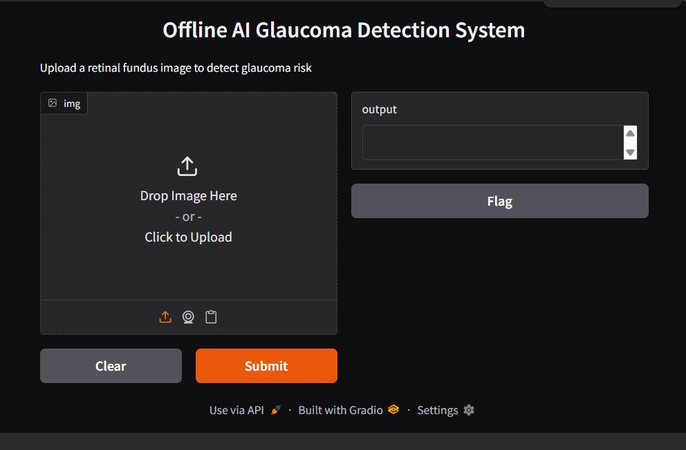
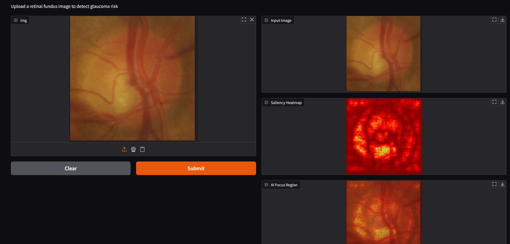
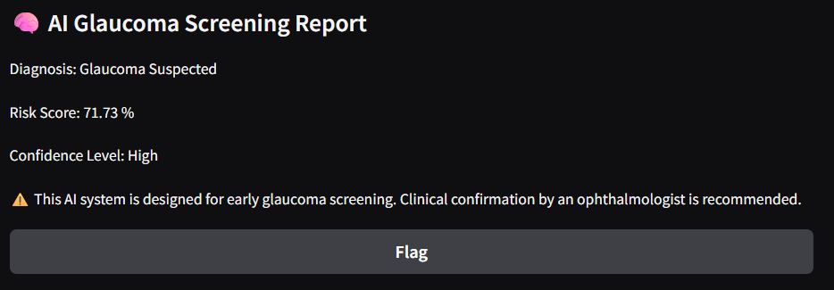

# GlaucoScan-XAI
AI-powered glaucoma detection system with explainable heatmaps for early screening using retinal images and designed for Offline Deployment 

------<<>>------
## 📸 Output

### 🖥️ Upload Interface

### 🧠 AI Processing Interface

### 📊 AI Screening Report

